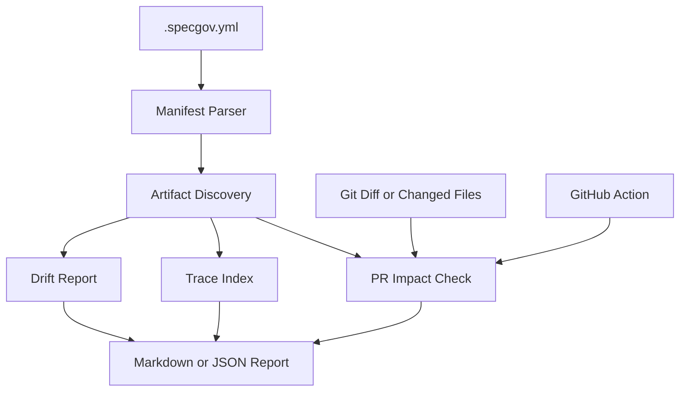

# SpecGov Core Design

**Spec**: `.specs/features/specgov-core/spec.md`
**Status**: Approved

## Architecture Overview

SpecGov is a small TypeScript CLI with reusable core modules. Commands load a `.specgov.yml` manifest, discover governed artifacts, evaluate checks, and render Markdown or JSON reports. The GitHub Action calls the same core `check-pr` flow.



## Components

### CLI

- **Purpose**: Expose `init`, `scan`, `check-pr`, `trace`, and `drift`.
- **Location**: `src/cli.ts`, `src/cli-app.ts`
- **Interfaces**:
  - `runCli(argv, cwd, io): Promise<number>`

### Manifest Parser

- **Purpose**: Parse YAML and normalize config defaults.
- **Location**: `src/manifest.ts`
- **Interfaces**:
  - `loadConfig(cwd, configPath): Promise<SpecGovConfig>`
  - `writeDefaultConfig(cwd, configPath, force): Promise<void>`

### Artifact Discovery

- **Purpose**: Find governed artifacts and parse lifecycle frontmatter.
- **Location**: `src/artifacts.ts`
- **Interfaces**:
  - `discoverArtifacts(config, cwd): Promise<ArtifactDiscovery>`

### Governance Checks

- **Purpose**: Evaluate scan, check-pr, trace, and drift behavior.
- **Location**: `src/checks.ts`
- **Interfaces**:
  - `runScan(options): Promise<SpecGovReport>`
  - `runCheckPr(options): Promise<SpecGovReport>`
  - `runTrace(options): Promise<TraceIndex>`
  - `runDrift(options): Promise<SpecGovReport>`

### Git Adapter

- **Purpose**: Return changed files from explicit inputs or `git diff`.
- **Location**: `src/git.ts`

### GitHub Action

- **Purpose**: Adapt action inputs to `runCheckPr` and publish summary/outputs.
- **Location**: `src/action.ts`

## Data Models

```typescript
interface SpecGovConfig {
  version: number;
  mode: "advisory" | "strict";
  artifacts: ArtifactRule[];
  mappings: MappingRule[];
  rules: GovernanceRules;
  ignore: string[];
}
```

```typescript
interface SpecGovReport {
  command: string;
  status: "pass" | "warn" | "fail" | "error";
  mode: "advisory" | "strict";
  findings: Finding[];
}
```

## Error Handling Strategy

| Error Scenario                      | Handling                       | User Impact                    |
| ----------------------------------- | ------------------------------ | ------------------------------ |
| Missing config                      | Runtime error with exit code 2 | User runs `specgov init`.      |
| Invalid YAML/schema                 | Runtime error with exit code 2 | User fixes manifest.           |
| Governance warning in advisory mode | Report warning and exit 0      | Adoption remains low-friction. |
| Governance warning in strict mode   | Report failure and exit 1      | CI can block merges.           |

## Tech Decisions

| Decision        | Choice                 | Rationale                                                  |
| --------------- | ---------------------- | ---------------------------------------------------------- |
| Manifest format | YAML                   | Readable and familiar in CI.                               |
| CLI stack       | TypeScript + commander | Good fit for GitHub Action and npm distribution.           |
| Matching        | fast-glob + picomatch  | Reliable glob discovery and matching.                      |
| Action bundle   | @vercel/ncc            | GitHub Actions require runtime dependencies to be bundled. |
| AI audit        | Out of core v1         | Keeps OSS adoption easy and deterministic.                 |
