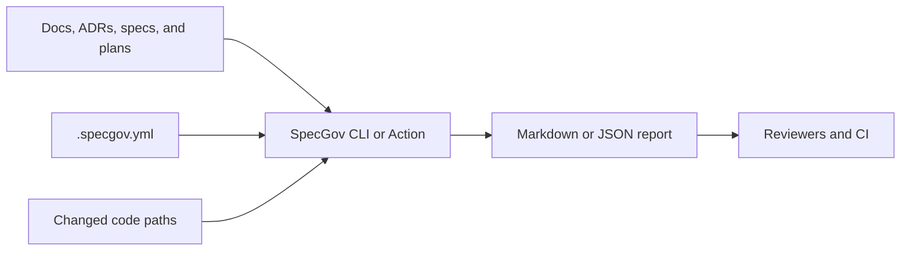

# SpecGov

[](https://github.com/paladini/specgov/actions/workflows/ci.yml)
[](LICENSE)
[](https://paladini.github.io/specgov/)
[](package.json)
[](#project-status)

**Spec governance for Git repositories. Keep code, docs, ADRs, requirements,
and spec folders aligned in every pull request.**

SpecGov is a deterministic CLI and GitHub Action for teams that use specs as
engineering contracts. It maps implementation paths to the source-of-truth
artifacts that explain them, then reports when code changes bypass those
artifacts.

It is not another spec framework. SpecGov works with the files you already
have: product requirements, ADRs, design docs, `.specs` folders, Kiro specs,
Spec Kit plans, and custom Markdown contracts.

- **Framework agnostic:** Bring any spec convention and describe it in one
  `.specgov.yml` manifest.
- **PR native:** Run locally or as a GitHub Action during review.
- **Advisory first:** Start with warnings, then move trusted areas to strict
  enforcement.
- **Audit friendly:** Emit Markdown for humans and JSON for automation.
- **Private by default:** No hosted service, API key, model call, telemetry, or
  repository upload.

## Contents

- [Why SpecGov exists](#why-specgov-exists)
- [How it works](#how-it-works)
- [Core capabilities](#core-capabilities)
- [Installation](#installation)
- [Quick start](#quick-start)
- [Manifest](#manifest)
- [Commands](#commands)
- [GitHub Action](#github-action)
- [Adoption recipes](#adoption-recipes)
- [Report example](#report-example)
- [Enterprise-friendly defaults](#enterprise-friendly-defaults)
- [How SpecGov differs from SpecTrace](#how-specgov-differs-from-spectrace)
- [Development](#development)
- [Security and privacy](#security-and-privacy)
- [Project status](#project-status)

## Why SpecGov exists

Spec-driven development breaks down when Git accepts code-only pull requests
for behavior that was supposed to be governed by requirements, ADRs, product
docs, or design plans. The result is familiar:

- requirements become stale after the implementation moves on;
- ADRs lose authority because reviewers cannot see when they were bypassed;
- AI-assisted changes become hard to audit after the conversation is gone;
- teams adopt multiple spec formats, then lose one shared governance layer;
- compliance and platform teams need traceability without a heavyweight tool.

SpecGov gives repositories a small contract:

1. Declare the artifacts that define expected behavior.
2. Map code paths to the artifacts that must move with them.
3. Check pull requests for missing spec impact.
4. Generate trace and drift reports that humans and automation can inspect.

## How it works



SpecGov does not parse your business logic or invent a new workflow. It reads
your manifest, discovers governed artifacts, compares changed files with your
declared mappings, and reports whether the review has enough spec context.

## Core capabilities

| Capability              | What it gives you                                            |
| ----------------------- | ------------------------------------------------------------ |
| Artifact discovery      | Finds governed docs, ADRs, specs, and requirements by glob.  |
| Lifecycle metadata      | Reads optional `status`, `owner`, and verification metadata. |
| PR impact checks        | Flags code changes that skip mapped spec artifacts.          |
| Unmapped code detection | Finds changed files outside your declared governance map.    |
| Trace index             | Emits JSON linking artifacts, mappings, and matched files.   |
| Drift report            | Reports stale, empty, orphaned, or superseded artifacts.     |
| GitHub Action           | Runs the same deterministic checks inside pull requests.     |
| Advisory/strict modes   | Lets teams observe first, then block trusted paths later.    |

## Installation

Install the CLI from npm:

```bash
npm install -g specgov
```

You can also run it without a global install:

```bash
npx specgov --help
```

After installation, the `specgov` command is available on your machine:

```bash
specgov --help
```

## Quick start

From the repository you want to govern:

```bash
specgov init
specgov scan
specgov check-pr --changed-file src/auth/session.ts
specgov trace --out .specgov.trace.json
specgov drift
```

Start in `advisory` mode so contributors can see findings without blocking
merges. Move selected repositories or paths to `strict` after the mapping has
earned trust in real pull requests.

## Manifest

SpecGov is configured with one YAML file:

```yaml
version: 1
mode: advisory

artifacts:
  - path: "docs/**/*.md"
    kind: documentation
    owner: docs
  - path: "adr/**/*.md"
    kind: decision
    owner: architecture
  - path: ".specs/**/*.md"
    kind: specification
    owner: engineering

mappings:
  - code: "src/auth/**"
    specs:
      - "docs/auth/**"
      - "adr/auth/**"
      - ".specs/features/auth/**"
    description: Authentication behavior must stay aligned with its specs.

rules:
  require_spec_impact_for_code_changes: true
  require_lifecycle_status: false
  require_owner_for_active_specs: false
  stale_after_days: 180

ignore:
  - "node_modules/**"
  - "dist/**"
  - ".git/**"
```

### Governed artifacts

Each `artifacts` entry tells SpecGov which files belong to your spec layer. Use
the folder convention your team already has:

- `docs/**/*.md` for product or engineering docs.
- `adr/**/*.md` for architectural decisions.
- `.specs/**/*.md` for TLC Spec Driven or custom specs.
- `.kiro/specs/**/*.md` for Kiro-style spec folders.
- `specs/**/*.md` for Spec Kit or repository-local plans.

### Code-to-spec mappings

Each `mappings` entry connects implementation paths to the artifacts that must
move with them. If `src/auth/**` changes and no mapped artifact changes,
SpecGov reports `SPEC_IMPACT_MISSING`.

When `require_spec_impact_for_code_changes` is enabled, SpecGov also reports
`CODE_CHANGE_UNMAPPED` for changed files that are not covered by any mapping,
are not governed artifacts, and are not ignored.

### Lifecycle frontmatter

Governed Markdown files can include optional lifecycle metadata:

```markdown
---
status: active
owner: platform
last_verified: 2026-06-27
---

# Authentication session contract
```

Supported statuses are `draft`, `active`, `superseded`, `deprecated`, and
`archived`. Superseded artifacts can declare `superseded_by` so readers know
where the current source of truth moved.

## Commands

| Command            | Purpose                                              | Common use             |
| ------------------ | ---------------------------------------------------- | ---------------------- |
| `specgov init`     | Create a starter `.specgov.yml`.                     | First-time setup.      |
| `specgov scan`     | Discover governed artifacts and lifecycle findings.  | Local audit.           |
| `specgov check-pr` | Compare changed files against code-to-spec mappings. | Pull request checks.   |
| `specgov trace`    | Generate a machine-readable trace index.             | Automation and audits. |
| `specgov drift`    | Report stale, empty, orphaned, or superseded specs.  | Maintenance reviews.   |

All report commands default to Markdown output. Use `--format json` when
another tool needs to consume the result:

```bash
specgov scan --format json
specgov check-pr --format json --changed-file src/payments/checkout.ts
```

Exit codes:

- `0`: pass, or warnings in `advisory` mode.
- `1`: governance failure in `strict` mode.
- `2`: runtime or configuration error.

## GitHub Action

Run SpecGov on pull requests:

```yaml
name: SpecGov

on:
  pull_request:

jobs:
  specgov:
    runs-on: ubuntu-latest
    steps:
      - uses: actions/checkout@v5
        with:
          fetch-depth: 0

      - uses: paladini/specgov@v0.1.0
        with:
          mode: advisory
          base-ref: ${{ github.event.pull_request.base.sha }}
          head-ref: ${{ github.event.pull_request.head.sha }}
```

Pin the Action to a version tag for repeatable CI behavior.

Use `mode: strict` when governance findings should block the pull request.

### Action inputs

| Input           | Default        | Description                                              |
| --------------- | -------------- | -------------------------------------------------------- |
| `config`        | `.specgov.yml` | Path to the manifest.                                    |
| `mode`          | `advisory`     | `advisory` reports warnings; `strict` fails on warnings. |
| `base-ref`      | unset          | Base git ref for pull request comparison.                |
| `head-ref`      | unset          | Head git ref for pull request comparison.                |
| `output-format` | `markdown`     | Report format for logs and `report-json`.                |
| `changed-files` | unset          | Newline-delimited file list when you provide the diff.   |

### Action outputs

| Output        | Description                                     |
| ------------- | ----------------------------------------------- |
| `status`      | `pass`, `warn`, `fail`, or `error`.             |
| `report-json` | Serialized `SpecGovReport` for downstream jobs. |

## Adoption recipes

The `examples/` folder includes starter manifests for common repository shapes:

| Repository style  | Example                                                                              |
| ----------------- | ------------------------------------------------------------------------------------ |
| Docs-only         | [`examples/docs-only/.specgov.yml`](examples/docs-only/.specgov.yml)                 |
| ADR-heavy         | [`examples/adr-heavy/.specgov.yml`](examples/adr-heavy/.specgov.yml)                 |
| Framework folders | [`examples/framework-folders/.specgov.yml`](examples/framework-folders/.specgov.yml) |

A practical rollout usually looks like this:

1. Run `specgov init`.
2. Add one or two high-value mappings, not the whole repository.
3. Run `specgov scan` and fix obvious empty globs.
4. Add the GitHub Action in `advisory` mode.
5. Review warnings in a few pull requests.
6. Tighten high-confidence areas with `mode: strict`.
7. Schedule `specgov drift` as a periodic maintenance check.

## Report example

```markdown
# SpecGov check-pr report

Status: **warn**
Mode: `advisory`
Findings: 1 (0 errors, 1 warnings, 0 info)

## Changed Files

- `src/auth/session.ts`

## Findings

- **WARNING SPEC_IMPACT_MISSING**: Code changed under src/auth/** without a
  related spec artifact change.
  - Related: `src/auth/session.ts`, `docs/auth/**`, `adr/auth/**`
  - Suggestion: Update a mapped spec artifact or run in advisory mode until
    this mapping is ready to enforce.
```

## Enterprise-friendly defaults

SpecGov is small, but its defaults are designed for serious engineering teams:

- **No data leaves your runner.** SpecGov reads local files and git metadata.
- **No vendor workflow lock-in.** The manifest points to any docs, ADRs, or
  spec folders your organization already uses.
- **No all-at-once migration.** Advisory mode lets teams learn before
  enforcement.
- **Machine-readable outputs.** JSON reports can feed dashboards, policy jobs,
  or release evidence.
- **Review-first governance.** Findings appear where engineers already make
  decisions: pull requests and local checks.

## How SpecGov differs from SpecTrace

SpecTrace for AI Coding verifies whether a specific AI-assisted change
satisfies explicit requirements and evidence maps. SpecGov operates one layer
higher: it governs living spec artifacts across Git workflows regardless of
author, framework, or whether AI was involved.

They work well together:

- Use SpecGov to keep the repository's source-of-truth artifacts aligned.
- Use SpecTrace to audit the evidence behind a specific implementation change.

## Development

```bash
npm ci
npm test
npm run build
npm run lint
npm run typecheck
npm run format:check
```

SpecGov uses TLC Spec Driven internally. Public behavior changes should update
the relevant files under `.specs/`, tests, and README examples in the same pull
request.

## Security and privacy

SpecGov runs locally or in your CI runner. Version 0.1 does not call external
services, require API keys, or send repository contents to a model.

See [`SECURITY.md`](SECURITY.md) for vulnerability reporting.

## Project status

SpecGov is in pre-release development. The CLI, report shape, and Action inputs
are usable today, but may still change before the first tagged release.

Current project links:

- Website: <https://paladini.github.io/specgov/>
- npm: <https://www.npmjs.com/package/specgov>
- Repository: <https://github.com/paladini/specgov>
- Roadmap: [`.specs/project/ROADMAP.md`](.specs/project/ROADMAP.md)
- Release process: [`RELEASING.md`](RELEASING.md)
- Contribution guide: [`CONTRIBUTING.md`](CONTRIBUTING.md)
